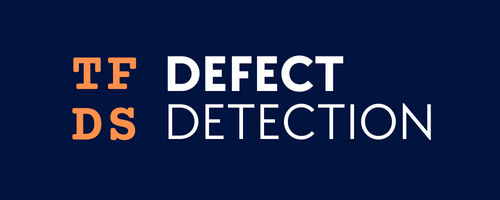

========================================
TensorFlow Datasets for Defect Detection
========================================

To directly jump into look at the NOTEBOOK.

.. admonition:: Features

    - tensorflow.data.Dataset builder for defect segmentation
    - Comes with unsupervised / self-supervised SotA datasets
        - MVTEC
        - VISA
    - Artificial defect generator
    - Evaluation data with hand labelled images

Install
-------

Create a new python=3.9 env and install `tfds_defect_detection` from pip

.. code-block:: bash

    pip install tfds_defect_detection

Examples
-----------

.. code-block:: python

    import tfds_defect_detection as tfd
    tfd.load()

Usage
-----------

.. admonition:: Docs

    For documentation and usage see

    https://tfds-defect-detection.readthedocs.io/en/latest/README.html

.. admonition:: Cite

    If this project helped you during your work:
    Until a publication is available, please cite as

    Tobias Schiele. (2022). TFDS DD - Datasets for Defect Detection. https://github.com/thetoby9944/tfds_defect_detection.

    .. code-block:: latex

        @misc{Schiele2019,
            author = {Tobias Schiele},
            title = {TFDS DD - Datasets for Defect Detection},
            year = {2022},
            publisher = {GitHub},
            journal = {GitHub repository},
            howpublished = {\url{https://github.com/thetoby9944/tfds_defect_detection}},
        }

